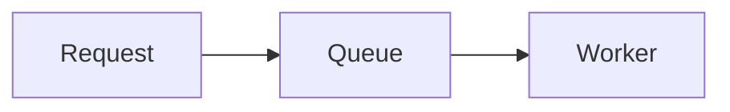

```mermaid
architecture-beta
  group aws(cloud)[AWS]

  service api(logos:aws-api-gateway)[API Gateway] in aws
  service queue(logos:aws-sqs)[SQS] in aws
  service worker(logos:aws-lambda)[Lambda] in aws
  service store(logos:aws-dynamodb)[DynamoDB] in aws

  api:R --> L:queue
  queue:R --> L:worker
  worker:R --> L:store
```

# sheta.dev

Minimal, text-first Astro blog for `https://sheta.dev` with first-class Markdown delivery for software agents.

## Local development

```bash
npm install
npm run dev
```

Open `http://localhost:4321`.

## Build

```bash
npm run build
```

The static site is emitted to `dist/`.

## Cloudflare Pages

Use:

- Framework preset: **Astro**
- Build command: `npm run build`
- Build output directory: `dist`
- Production branch: `main`
- Custom domain: `sheta.dev`

`public/_worker.js` is copied to the deployment root and performs content negotiation at the edge.

## Agent retrieval

Human HTML:

```bash
curl https://sheta.dev/posts/why-this-site-is-plain
```

Same clean URL as Markdown:

```bash
curl -H "Accept: text/markdown" \
  https://sheta.dev/posts/why-this-site-is-plain
```

Explicit Markdown:

```bash
curl https://sheta.dev/posts/why-this-site-is-plain.md
```

Corpus indexes:

```bash
curl https://sheta.dev/llms.txt
curl https://sheta.dev/llms-full.txt
```

## Add a post

Create `src/content/posts/my-post.md`:

```md
---
title: "My post"
description: "One-sentence summary."
published: 2026-08-13
tags: [systems]
---

Write Markdown here.
```

The build automatically creates both `/posts/my-post` and `/posts/my-post.md`, then adds the post to `/llms.txt`, `/llms-full.txt`, RSS, and the sitemap.

## Add a Mermaid diagram

Use a fenced `mermaid` block in a post. The browser renders the diagram on the HTML page. The Markdown endpoint retains the diagram source.

````text

````

Use AWS service icons in Mermaid architecture diagrams with the registered Iconify `logos` pack:

````text

````

The browser loads pinned Mermaid and Iconify modules from jsDelivr. Add an `accTitle` and `accDescr` to each diagram that needs an accessible name and description. If Mermaid does not load or cannot render a diagram, the page shows its source block.
