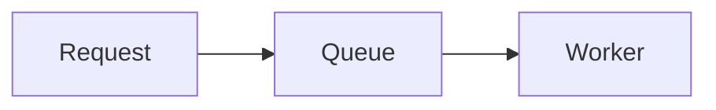

```mermaid
architecture-beta
  group aws(cloud)[AWS]
  service source(logos:aws-kinesis)[Kinesis] in aws
  service job(logos:apache-spark)[EMR Spark] in aws
  source:R --> L:job
```

# blog.sheta.dev

Text-first Astro blog for `https://blog.sheta.dev` with Markdown delivery for software agents.

## Local development

```bash
npm install
npm run dev
```

Open `http://localhost:4321`.

## Build

```bash
npm run build
```

The static site is emitted to `dist/`.

## Accessibility

The colour-theme control supports system, light, dark, and high-contrast modes. Code highlighting ships with separate high-contrast light and dark palettes, so it does not rely on a dark palette in light mode.

The “Read page aloud” control uses the browser's built-in Web Speech API. Readers can preview and choose among the English voices exposed by their browser or operating system. Network voices and voices labelled natural, enhanced, premium, or neural are preferred, and content is spoken in semantic sections for better pacing. Voice availability and quality still depend on the reader's device. Speech does not call the Worker or add a paid text-to-speech service. A consistently neural voice would require a cloud text-to-speech provider, add network and privacy considerations, and may add usage cost.

## Cloudflare Workers

The repository deploys static assets and a small content-negotiation Worker with `wrangler.jsonc`.

```bash
npm run build
npx wrangler deploy
```

The production custom domain is `blog.sheta.dev`. The Worker in `worker/index.js` serves Markdown when a post request includes `Accept: text/markdown`.

## Agent retrieval

Human HTML:

```bash
curl https://blog.sheta.dev/posts/why-this-site-is-plain/
```

Same clean URL as Markdown:

```bash
curl -H "Accept: text/markdown" \
  https://blog.sheta.dev/posts/why-this-site-is-plain/
```

Explicit Markdown:

```bash
curl https://blog.sheta.dev/posts/why-this-site-is-plain.md
```

Corpus indexes:

```bash
curl https://blog.sheta.dev/llms.txt
curl https://blog.sheta.dev/llms-full.txt
```

## Add a post

Create `src/content/posts/my-post.md`:

```md
---
title: "My post"
description: "One-sentence summary."
published: 2026-08-13
tags: [systems]
---

Write Markdown here.
```

The build creates `/posts/my-post/` and `/posts/my-post.md`, then adds the post to `/llms.txt`, `/llms-full.txt`, RSS, and the sitemap.

## Add a Mermaid diagram

Use a fenced `mermaid` block in a post. The browser renders the diagram on the HTML page. The Markdown endpoint retains the diagram source.

````text

````

Architecture diagrams can use the registered Iconify `logos` pack for real AWS service icons:

````text

````

The browser loads pinned Mermaid and Iconify modules from jsDelivr. Diagrams are re-rendered with explicit light, dark, or high-contrast colours when the site theme changes. Add an `accTitle` and `accDescr` to each diagram that needs an accessible name and description. If Mermaid or the AWS icon pack does not load, or a diagram cannot render, the page shows its source block as a fallback.
