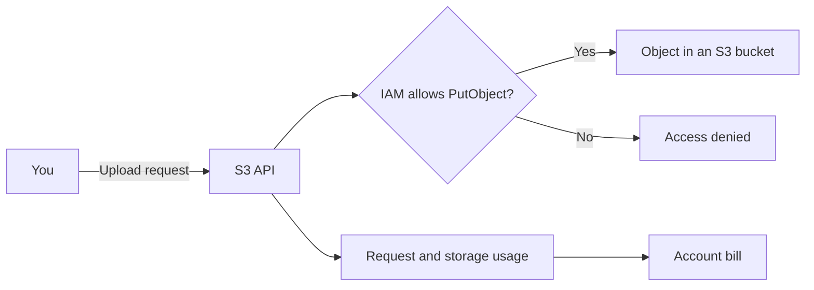

Suppose you upload one file to Amazon Simple Storage Service, or Amazon S3. Your browser sends an API request. AWS checks your identity, requested action, and target resource. A Region controls where the resource lives. AWS records the storage and request for billing.

That one upload contains much of the AWS mental model.

You do not need to memorize hundreds of service names. Start with five ideas: accounts, Regions, resources, permissions, and cost. Most AWS systems use them.

*Figure 1. One upload becomes an authorized API request, a stored resource, and recorded usage.*

## Cloud computing rents capabilities

A physical server gives you processors, memory, disks, and network connections. You buy it before you know how much work it must handle. You also install it, power it, repair it, and replace it.

Cloud computing gives you similar capabilities through APIs. You request storage, compute, databases, and networks when you need them. The provider operates the physical infrastructure. You pay under the rules for each service.

AWS defines cloud computing as the on-demand delivery of IT resources through the internet with pay-as-you-go pricing. The definition matters because it names two properties. You request resources when needed, and your usage affects cost. [AWS explains cloud computing](https://aws.amazon.com/what-is-cloud-computing/).

S3 provides object storage. An object combines data with metadata. A text file, photograph, backup, or log can become an S3 object.

## Your account is the first boundary

An AWS account contains resources and connects them to identities and billing. The account has a unique identifier. AWS uses the account as a security, access, and billing boundary. [AWS explains accounts](https://docs.aws.amazon.com/accounts/latest/reference/accounts-welcome.html).

Imagine two developers who use different AWS accounts. Each developer creates a bucket named for a separate project. One developer cannot read the other developer's objects by default. Someone must grant cross-account access before that request can succeed.

This boundary explains the phrase *cross-account*. It does not mean that data moves between two regions or two companies. It means that a request crosses an account boundary.

Your account begins with a root user. The root user has complete access. AWS recommends that you register multi-factor authentication and reserve the root user for tasks that require it. Use an administrative identity for daily work. [AWS lists root-user practices](https://docs.aws.amazon.com/IAM/latest/UserGuide/root-user-best-practices.html).

## A Region controls location

AWS divides its infrastructure into Regions. A Region is a separate geographic area, such as US East in Northern Virginia. Most resources belong to one Region.

Each Region contains multiple Availability Zones. An Availability Zone is an isolated location with independent power, networking, and connectivity. Applications can use several zones to reduce the effect of one location failing. [AWS explains Regions and Availability Zones](https://docs.aws.amazon.com/AWSEC2/latest/UserGuide/using-regions-availability-zones.html).

You select a Region when you create an S3 bucket. S3 then manages object placement for the selected storage class. For example, S3 Standard stores objects across at least three Availability Zones in that Region. [Amazon S3 documents its data redundancy](https://docs.aws.amazon.com/AmazonS3/latest/userguide/DataDurability.html).

The distinction is useful:

- You select the Region.
- The service can manage several Availability Zones for you.
- AWS does not copy most resources to another Region unless you configure that behavior.

Region selection can affect latency, service availability, legal requirements, and price. Most beginner projects need one Region. Record its name with the project resources.

## Services contain resources and actions

AWS documentation often combines three concepts in one sentence:

- A **service** provides a capability. Amazon S3 provides object storage.
- A **resource** is something you create or address. Buckets and objects are S3 resources.
- An **action** is an operation. `s3:PutObject` uploads object data to a bucket.

The same pattern appears elsewhere. Amazon EC2 is a compute service. An EC2 instance is a resource. `ec2:StartInstances` is an action.

AWS gives many resources an Amazon Resource Name, or ARN. An ARN identifies one resource for an API request or policy. Each service defines its own ARN format. Treat the ARN as the resource's exact address inside AWS.

When you read an architecture diagram, ask three questions:

1. Which service provides the capability?
2. Which resource did the team create?
3. Which actions connect the resources?

These questions turn a page of product names into a sequence of operations.

## The console, CLI, and SDK call service APIs

You can upload a file through the S3 page in the AWS Management Console. You can also use the AWS Command Line Interface or an AWS software development kit. All three methods call S3 APIs.

The tools serve different users:

- The console helps a person inspect and change resources in a browser.
- The CLI helps a person or script run commands in a shell.
- An SDK lets application code call AWS services.

The console is not a separate control system. It is one client of the AWS APIs. This fact helps when a console error mentions an action such as `s3:PutObject`. The message names the API permission that the request needs.

## IAM decides whether AWS allows the request

AWS Identity and Access Management, or IAM, controls access to AWS resources. IAM evaluates a request as a set of parts:

- **Principal:** Who sent the request?
- **Action:** What operation did the principal request?
- **Resource:** Which resource did the principal name?
- **Context:** Which conditions apply, such as time, network, or encryption requirements?

For the file upload, the question can read like this:

> Can this signed-in identity perform `s3:PutObject` on this object in this bucket?

AWS authenticates the principal and evaluates the applicable policies. An explicit denial wins over an allow. If no policy allows the request, AWS denies it. [AWS documents policy evaluation](https://docs.aws.amazon.com/IAM/latest/UserGuide/reference_policies_evaluation-logic.html).

This model explains many `AccessDenied` errors. The principal may be valid while the requested action or resource remains outside its permissions.

Avoid long-lived access keys when a role or federated identity can supply temporary credentials. Do not create root-user access keys. These rules reduce the damage that a leaked credential can cause.

## Usage creates cost

AWS does not apply one price formula across its services. Each service defines its own meters. Common meters include:

- stored data over time.
- API requests.
- compute time and allocated capacity.
- data transferred between locations or to the internet.

An S3 upload can add stored bytes and a request. Later downloads can add more requests and data transfer. The amount may be small, but the pattern scales with usage.

New AWS customers can receive credits under the current AWS Free Tier program. Customers who create accounts after July 15, 2025 can select a free plan. That plan ends after six months or when its credits are depleted. Older accounts follow the legacy program. [AWS documents the current Free Tier](https://docs.aws.amazon.com/awsaccountbilling/latest/aboutv2/free-tier.html).

Free Tier does not replace cost monitoring. Service eligibility and limits can change. Read the current service pricing page before you create a resource.

AWS Budgets can send alerts and run configured actions. A budget alert is not a real-time spending cap. AWS updates budget information several times each day, and charges can continue before an alert arrives. [AWS documents budget timing](https://docs.aws.amazon.com/cost-management/latest/userguide/budgets-managing-costs.html).

Use a budget as one guardrail. Remove resources when you finish an exercise. Check the billing console after the work.

## AWS and you divide responsibility

AWS secures and operates the physical infrastructure. You control your data, identities, permissions, and service configuration. AWS calls this division the shared responsibility model. [AWS explains the shared responsibility model](https://aws.amazon.com/compliance/shared-responsibility-model/).

For the S3 object, AWS operates the storage hardware and service. You decide who can read the object. You also select encryption options, retention rules, and public-access settings.

A managed service removes some operational work. It does not make all configurations safe. The service documentation tells you which responsibilities remain yours.

## Most architectures use a few service families

Service names become easier when you first identify the family:

| Family | Question | Examples |
|---|---|---|
| Compute | Where does code run? | EC2, Lambda, ECS |
| Storage | Where do files or objects live? | S3, EBS, EFS |
| Database | Where does structured application data live? | RDS, DynamoDB |
| Networking | How does traffic reach and cross resources? | VPC, Route 53, CloudFront |
| Messaging | How do components exchange work? | SQS, SNS, EventBridge, Kinesis |

You do not need to learn all examples now. Find the family first. Then learn why the architecture selected one service from that family.

## Try the upload with a disposable object

You can understand this article without an AWS account. If you use an account, secure it before the exercise. AWS provides a [setup guide for a new environment](https://docs.aws.amazon.com/hands-on/latest/setup-environment/setup-environment.html).

Use these steps with an administrative identity, not the root user:

1. Open the Amazon S3 console.
2. Write down the selected Region.
3. Create one general-purpose bucket.
4. Keep Block Public Access enabled.
5. Upload one small text file.
6. Open the object's properties.
7. Find the bucket, object key, Region, and storage class.
8. Delete the object.
9. Delete the empty bucket.
10. Check Free Tier usage and billing.

Do not make the object public for this exercise. Do not leave the bucket for later. The deletion steps are part of the exercise.

## Read an AWS diagram with the model

You can now translate a sentence from an advanced architecture:

> An EMR job in Account A writes to a Kinesis stream in Account B.

The sentence contains the same five ideas:

- Two AWS accounts create a security and billing boundary.
- EMR and Kinesis are services.
- The job and stream are resources.
- IAM policies must allow a write action across the account boundary.
- The job, stream, requests, and data can create cost.

The services changed. The mental model did not.
