[XML Bridge](https://github.com/Shetta/XML-Bridge) converts music notation among CMME, MEI, and JSON. Its Python service can process one file through an HTTP request. Batch imports add two risks: a worker can fail, and an event can arrive more than once.

I would place an SQS queue between the upload and the converter. The queue holds work while Lambda scales the converter. DynamoDB records job state. Separate S3 buckets store inputs and results.

Some early notation requires a musician to resolve ambiguous features. The worker records those jobs as `NEEDS_REVIEW` and reserves retries for infrastructure failures.

The diagram maps one conversion job across the AWS services:

```mermaid
architecture-beta
  group aws(cloud)[AWS]

  service input(logos:aws-s3)[Input bucket] in aws
  service queue(logos:aws-sqs)[Job queue] in aws
  service worker(logos:aws-lambda)[Converter] in aws
  service state(logos:aws-dynamodb)[Job state] in aws
  service output(logos:aws-s3)[Output bucket] in aws
  service dlq(logos:aws-sqs)[Dead letter queue] in aws

  input:R --> L:queue
  queue:R --> L:worker
  worker:B --> T:state
  worker:R --> L:output
  queue:B --> T:dlq
```



## Make the object key part of the protocol

Use an immutable input key such as:

```text
incoming/cmme-to-mei/01JABCXYZ/score.xml
```

The key identifies the conversion path and the job. S3 sends an `ObjectCreated` event to a standard SQS queue. Lambda reads the object after it receives the message.

[S3 Event Notifications use at-least-once delivery](https://docs.aws.amazon.com/AmazonS3/latest/userguide/EventNotifications.html). They can arrive out of order. The converter must accept a duplicate event without creating a second result.

The pipeline treats each immutable key as an independent job, so a standard queue fits. A future per-dataset ordering rule would require EventBridge before an SQS FIFO queue. S3 cannot send an event notification to a FIFO queue without EventBridge.

Use separate input and output buckets. AWS warns that a function can create an execution loop when it writes to the bucket that invoked it. Prefix filters can prevent the loop. Separate buckets make the boundary clear.

## Treat duplicate delivery as normal input

[Lambda processes SQS records at least once](https://docs.aws.amazon.com/lambda/latest/dg/with-sqs.html). A worker can receive the same message after a timeout or retry. The conversion operation needs an idempotency key.

Create the `job_id` before the upload. Use the same value in the S3 key, SQS message, and DynamoDB record. Use `job_id:revision` as the `attempt_id` for each conversion pass.

[Powertools for AWS Lambda (Python)](https://docs.aws.amazon.com/powertools/python/latest/utilities/idempotency/) provides an idempotency utility backed by DynamoDB. A per-job wrapper can look like this:

```python
import os

from aws_lambda_powertools.utilities.idempotency import (
    DynamoDBPersistenceLayer,
    IdempotencyConfig,
    idempotent_function,
)

persistence = DynamoDBPersistenceLayer(
    table_name=os.environ["IDEMPOTENCY_TABLE"]
)
config = IdempotencyConfig(event_key_jmespath="attempt_id")


@idempotent_function(
    data_keyword_argument="job",
    persistence_store=persistence,
    config=config,
)
def convert_job(*, job: dict) -> dict:
    source = download(job["input_key"])
    result = convert(source, job["target_format"])
    return upload(job["output_key"], result)
```

The persistence record distinguishes work in progress from completed work. It expires stale locks after a Lambda timeout. A custom DynamoDB conditional write can use [`attribute_not_exists`](https://docs.aws.amazon.com/amazondynamodb/latest/developerguide/Expressions.ConditionExpressions.html). That code must handle an expired processing lease.

## Return each failed message

Lambda sends a batch of SQS messages to one invocation. An exception makes Lambda return the full batch to the queue. Lambda then repeats conversions that succeeded before the exception.

Enable `ReportBatchItemFailures` on the event source mapping. Return the identifiers for messages that need another attempt:

```python
import json
import logging

logger = logging.getLogger(__name__)


def handler(event, _context):
    failures = []

    for record in event["Records"]:
        try:
            message = json.loads(record["body"])
            job = job_from_s3_event(message)
            convert_job(job=job)
        except Exception:
            logger.exception(
                "Conversion failed",
                extra={"message_id": record["messageId"]},
            )
            failures.append({"itemIdentifier": record["messageId"]})

    return {"batchItemFailures": failures}
```

The `job_from_s3_event` helper decodes the bucket and object key. It builds the job fields that `convert_job` uses.

[AWS documents this partial batch response](https://docs.aws.amazon.com/lambda/latest/dg/services-sqs-errorhandling.html) for SQS event sources. The handler must catch record errors and return them. An exception outside the loop still fails the full batch.

Set the queue visibility timeout to [at least six times the Lambda timeout](https://docs.aws.amazon.com/lambda/latest/dg/services-sqs-configure.html). Add `MaximumBatchingWindowInSeconds` when you configure a batch window. AWS recommends a `maxReceiveCount` of at least 5 before SQS moves a message to the dead-letter queue. An alarm should notify you when that queue receives a message.

## Record domain decisions as job state

Retries can recover from S3 timeouts or throttled AWS calls. A musician must resolve an ambiguous ligature.

The converter should store one of these states in DynamoDB:

- `PROCESSING`
- `NEEDS_REVIEW`
- `COMPLETED`
- `FAILED`

For `NEEDS_REVIEW`, store the unresolved feature and its location in the source document. Then return success to SQS. A review interface can collect the musician's decision and submit another SQS job revision.

Use `job_id:revision` as the `attempt_id` for that second pass. DynamoDB retains revision history. The worker treats each decision as a new conversion attempt.

## Keep the Lambda boundary explicit

[Lambda limits one invocation to 15 minutes](https://docs.aws.amazon.com/lambda/latest/dg/configuration-timeout.html). Measure conversion time with the largest supported files and leave time for S3 writes. A container worker can consume the same SQS job contract if a conversion approaches that limit.

I would build the pipeline in this order:

1. Define immutable S3 keys and the SQS message schema.
2. Add the standard queue, dead-letter queue, and redrive policy.
3. Add a Lambda consumer with partial batch responses.
4. Add DynamoDB records for idempotency and job state.
5. Add alarms for queue age, Lambda errors, and dead-letter messages.
6. Add the `NEEDS_REVIEW` path after automatic conversion works.

You can keep the music conversion code in Python. SQS controls delivery and retries, while DynamoDB records the result of each job and review revision.
