At 02:14 UTC, the replay operator released eighteen hours of retained events into the source stream. The Amazon Kinesis dashboard stayed quiet for seven minutes. Then the Lambda `IteratorAge` alarm crossed twenty minutes and kept climbing.

The cross-account relay ran at its concurrency limit. Fresh events had joined the replay. The backlog aged faster than the relay drained it.

The incident commander pulled the data-platform team into the call. One engineer opened the Lambda graph. Another opened the shard map. The source stream had 480 shards after the last split. Ordinary traffic stayed within relay capacity. The replay plus parsing and enrichment work exceeded it.

> "Which part is slow?" the commander asked.

The dashboard had no answer.

At 02:22, the on-call engineer bought time. The oldest replay record was eighteen hours old, close enough to the default 24-hour retention window to make diagnosis risky. She raised retention to 72 hours:

```bash
aws kinesis increase-stream-retention-period \
  --stream-name production-events \
  --retention-period-hours 72
```

AWS recommends increasing retention as a stopgap when [consumer lag threatens record expiry](https://docs.aws.amazon.com/streams/latest/dev/troubleshooting-consumers.html). The command kept evidence and unprocessed records available while the team replaced the relay.

*The incident is a composite built from production constraints. The AWS behavior and configurations use current service documentation.*

## Engineers had left the workload out of the first diagram

The relay started as a copy function. Account A owned the source Kinesis stream. Account B owned the analytics stream and an AWS Glue Streaming job. Security prohibited a cross-account `sts:AssumeRole` call.

Glue could not read the source stream under that rule. Its Kinesis connector [requires `awsSTSRoleARN` and `awsSTSSessionName`](https://docs.aws.amazon.com/glue/latest/dg/glue-streaming-connections.html) for a stream in another account. The team placed Lambda in Account A and granted its execution role write access to the destination stream through a Kinesis resource policy.

Engineers then added envelope decoding, schema checks, tenant enrichment, and audit writes. A replay forced the whole workload through short invocations tied to source-shard polling.

At 02:31, the data-platform engineer wrote one line in the incident notes:

```text
480 source shards x 2 MiB/s dedicated read throughput = 960 MiB/s read allocation
```

Enhanced fan-out gives a registered Kinesis consumer [2 MiB per second of read throughput for each shard](https://docs.aws.amazon.com/streams/latest/dev/enhanced-consumers.html). That calculation measured the available Kinesis read allocation. Spark capacity, record size, transformations, and destination writes still governed application throughput.

The replacement needed one Spark task per source shard, enough executors to run those tasks, and checkpoints that survived the death of any worker. Amazon EMR 7.1 had already placed the [Spark Structured Streaming Kinesis connector](https://docs.aws.amazon.com/emr/latest/ReleaseGuide/emr-spark-structured-streaming-kinesis.html) on EMR on EKS and EMR on EC2.

By 02:42, the team had stopped treating the bridge as a function.

## The security rule put compute in Account A

The EMR Kinesis connector has a documented cross-account mode. The Spark job runs in the consumer account and sets `kinesis.stsRoleArn` to a role in the producer account. That mode broke the security rule from the first review.

The connector source options [accept `kinesis.streamName`](https://github.com/awslabs/spark-sql-kinesis-connector), not a source stream ARN. Kinesis [requires an ARN for cross-account calls](https://docs.aws.amazon.com/streams/latest/dev/controlling-access.html). A direct resource-policy read from EMR in Account B did not fit the connector's interface.

The team moved the Spark job to Account A, beside the source. The connector read a same-account stream with enhanced fan-out. Spark wrote to the Account B stream by ARN through the AWS SDK. Account B granted two Kinesis actions to one EMR job role in Account A.

```mermaid
architecture-beta
  accTitle: Cross-account Kinesis streaming with EMR
  accDescr: EMR Spark reads the source stream in the producer account and writes by ARN to the analytics stream in another account. DynamoDB and S3 store connector and Spark state.

  group producer(cloud)[Producer account]
  group analytics(cloud)[Analytics account]

  service source(logos:aws-kinesis)[Source stream] in producer
  service emr(logos:apache-spark)[EMR Spark] in producer
  service checkpoint(logos:aws-dynamodb)[Connector state] in producer
  service sparkstate(logos:aws-s3)[Spark checkpoint] in producer
  service destination(logos:aws-kinesis)[Analytics stream] in analytics
  service glue(logos:aws-glue)[Glue Streaming] in analytics

  source:R --> L:emr
  checkpoint:T -- B:emr
  sparkstate:T -- B:emr
  emr:R --> L:destination
  destination:R --> L:glue
```



*Figure 1. Spark stays beside the source stream. The SDK writer crosses the account boundary.*

EMR on EKS fit the company in the story because its platform team already operated an EKS cluster. The team registered a namespace as an EMR virtual cluster and assigned the streaming job its own execution role. An organization without that Kubernetes platform could run the same application on a long-running EMR on EC2 cluster.

## The analytics team wrote a two-action contract

The analytics account owned the destination stream and its policy. The [`AWS::Kinesis::ResourcePolicy`](https://docs.aws.amazon.com/AWSCloudFormation/latest/TemplateReference/aws-resource-kinesis-resourcepolicy.html) change named the EMR job role instead of trusting all of Account A:

```yaml
AnalyticsIngressPolicy:
  Type: AWS::Kinesis::ResourcePolicy
  Properties:
    ResourceArn: !GetAtt AnalyticsIngress.Arn
    ResourcePolicy:
      Version: "2012-10-17"
      Statement:
        - Sid: AllowProducerEmrWrites
          Effect: Allow
          Principal:
            AWS: arn:aws:iam::111111111111:role/emr-stream-bridge
          Action:
            - kinesis:PutRecord
            - kinesis:PutRecords
          Resource: !GetAtt AnalyticsIngress.Arn
```

Kinesis evaluates that resource policy with the identity policy on the EMR role. AWS requires [an allow on both sides of a cross-account request](https://docs.aws.amazon.com/IAM/latest/UserGuide/reference_policies_evaluation-logic-cross-account.html). The role in Account A carried the matching statement:

```json
{
  "Version": "2012-10-17",
  "Statement": [
    {
      "Sid": "WriteAnalyticsIngress",
      "Effect": "Allow",
      "Action": [
        "kinesis:PutRecord",
        "kinesis:PutRecords"
      ],
      "Resource": "arn:aws:kinesis:us-east-1:222222222222:stream/analytics-ingress"
    },
    {
      "Sid": "EncryptAnalyticsIngress",
      "Effect": "Allow",
      "Action": "kms:GenerateDataKey",
      "Resource": "arn:aws:kms:us-east-1:222222222222:key/00000000-1111-2222-3333-444444444444"
    }
  ]
}
```

The destination KMS key policy granted the same role `kms:GenerateDataKey`. Kinesis documents that [producers need `kms:GenerateDataKey`](https://docs.aws.amazon.com/streams/latest/dev/permissions-user-key-KMS.html) for a stream encrypted with a customer-managed key. The key policy restricted use to the Kinesis service and the destination stream:

```json
{
  "Sid": "AllowProducerEmrToEncryptForAnalyticsIngress",
  "Effect": "Allow",
  "Principal": {
    "AWS": "arn:aws:iam::111111111111:role/emr-stream-bridge"
  },
  "Action": "kms:GenerateDataKey",
  "Resource": "*",
  "Condition": {
    "StringEquals": {
      "kms:ViaService": "kinesis.us-east-1.amazonaws.com",
      "kms:EncryptionContext:aws:kinesis:arn": "arn:aws:kinesis:us-east-1:222222222222:stream/analytics-ingress"
    }
  }
}
```

The team did not store access keys in a Spark configuration. EMR on EKS supplied the [job execution role through IAM Roles for Service Accounts](https://docs.aws.amazon.com/emr/latest/EMR-on-EKS-DevelopmentGuide/iam-execution-role.html). EMR on EC2 would supply an instance profile or a runtime role. Both options put temporary credentials into the AWS SDK default provider chain.

## At 03:05, engineers mapped shards to Spark tasks

At 03:05, the engineer submitted the first catch-up job. [Amazon EMR on EKS 7.13.0](https://docs.aws.amazon.com/emr/latest/EMR-on-EKS-DevelopmentGuide/emr-eks-7.13.0.html) includes Spark 3.5.6, and EMR releases from 7.1 include the Kinesis connector. The application did not download a connector JAR during startup.

The engineers assigned the job a named enhanced fan-out consumer. The connector stored its shard metadata in DynamoDB. Spark stored query state in S3:

```python
import os

from pyspark.sql import SparkSession
from pyspark.sql.functions import col, from_json, struct, to_json
from pyspark.sql.types import LongType, StringType, StructField, StructType


REGION = os.environ.get("AWS_REGION", "us-east-1")
SOURCE_STREAM = "production-events"
DESTINATION_STREAM_ARN = (
    "arn:aws:kinesis:us-east-1:222222222222:stream/analytics-ingress"
)
CHECKPOINT = "s3://producer-stream-state/analytics-bridge/v3"
QUARANTINE = "s3://producer-stream-quarantine/analytics-bridge/v3"

spark = SparkSession.builder.appName("cross-account-stream-bridge").getOrCreate()

payload_schema = StructType(
    [
        StructField("tenant_id", StringType(), False),
        StructField("event_id", StringType(), False),
        StructField("event_type", StringType(), False),
        StructField("event_time_ms", LongType(), False),
    ]
)

source = (
    spark.readStream.format("aws-kinesis")
    .option("kinesis.region", REGION)
    .option("kinesis.endpointUrl", f"https://kinesis.{REGION}.amazonaws.com")
    .option("kinesis.streamName", SOURCE_STREAM)
    .option("kinesis.consumerType", "SubscribeToShard")
    .option("kinesis.consumerName", "analytics-bridge-v3")
    .option("kinesis.startingPosition", "TRIM_HORIZON")
    .option("kinesis.failOnDataLoss", "true")
    .option("kinesis.metadataCommitterType", "DYNAMODB")
    .option("kinesis.dynamodb.tableName", "analytics-bridge-kinesis-state")
    .load()
)

decoded = source.select(
    col("data").cast("string").alias("json"),
    col("partitionKey").alias("source_partition_key"),
    col("sequenceNumber").alias("source_sequence_number"),
    col("approximateArrivalTimestamp").alias("source_arrival_time"),
)

parsed = (
    decoded.select(
        from_json("json", payload_schema).alias("event"),
        "json",
        "source_partition_key",
        "source_sequence_number",
        "source_arrival_time",
    )
)


def is_valid_event():
    return (
        col("event").isNotNull()
        & col("event.tenant_id").isNotNull()
        & col("event.event_id").isNotNull()
        & col("event.event_type").isNotNull()
        & col("event.event_time_ms").isNotNull()
    )


def select_outbound(batch):
    valid = batch.where(is_valid_event()).select(
        "event.*",
        "source_partition_key",
        "source_sequence_number",
        "source_arrival_time",
    )

    return valid.select(
        col("source_partition_key").alias("partition_key"),
        to_json(
            struct(
                "tenant_id",
                "event_id",
                "event_type",
                "event_time_ms",
                "source_sequence_number",
                "source_arrival_time",
            )
        ).cast("binary").alias("data"),
    )
```

The source sequence number stayed in each destination record. Spark can replay a micro-batch after a worker failure. Kinesis accepts duplicate writes, so downstream jobs need a stable identity. The event ID and source sequence number provide one.

`TRIM_HORIZON` served the replay. A planned cutover could use `AT_TIMESTAMP`. The team set `failOnDataLoss` because a shard that expires before Spark reads it should stop the bridge and page an operator.

## The engineers handled every partial failure

The built-in connector can write to Kinesis, but its sink configuration accepts a stream name. Kinesis tells cross-account producers to use the AWS SDK and a stream ARN. The SDK also exposes the result the team needed: [`PutRecords` can return HTTP 200 while individual records fail](https://docs.aws.amazon.com/kinesis/latest/APIReference/API_PutRecords.html).

The writer opened one Kinesis client for each Spark partition, respected both the 500-record and 10 MiB request limits, and retried failed entries:

```python
import random
import time
from collections.abc import Iterable

import boto3
from botocore.config import Config


MAX_PUT_ATTEMPTS = 8
MAX_PUT_RECORDS = 500
MAX_PUT_BYTES = 10 * 1024 * 1024


def put_batches(records: Iterable[dict]):
    batch = []
    batch_bytes = 0

    for record in records:
        record_bytes = len(record["Data"]) + len(record["PartitionKey"].encode("utf-8"))
        if record_bytes > MAX_PUT_BYTES:
            raise ValueError(f"Kinesis record is {record_bytes} bytes")

        if batch and (
            len(batch) == MAX_PUT_RECORDS
            or batch_bytes + record_bytes > MAX_PUT_BYTES
        ):
            yield batch
            batch = []
            batch_bytes = 0

        batch.append(record)
        batch_bytes += record_bytes

    if batch:
        yield batch


def put_with_retry(client, records: list[dict]) -> None:
    pending = records

    for attempt in range(MAX_PUT_ATTEMPTS):
        response = client.put_records(
            StreamARN=DESTINATION_STREAM_ARN,
            Records=pending,
        )

        failed = [
            request
            for request, result in zip(pending, response["Records"], strict=True)
            if result.get("ErrorCode")
        ]

        if not failed:
            return

        pending = failed
        delay = min(0.05 * (2**attempt), 5.0) + random.uniform(0.0, 0.1)
        time.sleep(delay)

    raise RuntimeError(f"Kinesis rejected {len(pending)} records after retries")


def write_partition(rows) -> None:
    client = boto3.client(
        "kinesis",
        region_name=REGION,
        config=Config(retries={"mode": "adaptive", "max_attempts": 10}),
    )

    records = (
        {
            "Data": bytes(row.data),
            "PartitionKey": row.partition_key,
        }
        for row in rows
    )

    try:
        for batch in put_batches(records):
            put_with_retry(client, batch)
    finally:
        client.close()


def publish_micro_batch(batch, batch_id: int) -> None:
    batch.persist()
    try:
        malformed = batch.where(~is_valid_event()).select(
            "json",
            "source_partition_key",
            "source_sequence_number",
            "source_arrival_time",
        )
        malformed.write.mode("overwrite").parquet(
            f"{QUARANTINE}/batch_id={batch_id}"
        )

        select_outbound(batch).foreachPartition(write_partition)
    finally:
        batch.unpersist()


query = (
    parsed.writeStream.foreachBatch(publish_micro_batch)
    .queryName("cross-account-stream-bridge")
    .option("checkpointLocation", CHECKPOINT)
    .trigger(processingTime="10 seconds")
    .start()
)

query.awaitTermination()
```

The callback wrote malformed records to a deterministic S3 path for each `batch_id`. A retry overwrote that path instead of adding another quarantine copy. The AWS SDK handled request failures. The loop handled record failures inside a successful request. If one Spark partition exhausted its attempts, the exception failed the micro-batch. Spark left the source offsets uncommitted and ran the batch again.

That recovery creates duplicates when some partitions reached Account B before another partition failed. Apache Spark documents [`foreachBatch` as at-least-once by default](https://spark.apache.org/docs/latest/streaming/apis-on-dataframes-and-datasets.html). A transactional sink can use `batch_id` to deduplicate a batch. Kinesis has no batch transaction, so the destination record carries source identity instead.

The team also kept `spark.speculation` disabled. The [connector warns](https://github.com/awslabs/spark-sql-kinesis-connector) that speculative execution can run two tasks for one shard and create a race.

## Platform ownership settled the EKS-versus-EC2 choice

The company already ran EKS across three Availability Zones. Its platform team managed node groups, pod logs, quotas, and upgrades. [EMR on EKS](https://aws.amazon.com/emr/features/eks/) let the data team reuse that compute pool and isolate the bridge in one namespace. The job used a pinned EMR release image and a driver retry policy:

```bash
aws emr-containers start-job-run \
  --virtual-cluster-id "$VIRTUAL_CLUSTER_ID" \
  --name cross-account-stream-bridge-v3 \
  --execution-role-arn arn:aws:iam::111111111111:role/emr-stream-bridge \
  --release-label emr-7.13.0-20260410 \
  --retry-policy-configuration '{"maxAttempts": 20}' \
  --job-driver '{
    "sparkSubmitJobDriver": {
      "entryPoint": "s3://producer-stream-code/bridge/v3/bridge.py",
      "sparkSubmitParameters": "--conf spark.dynamicAllocation.enabled=true --conf spark.dynamicAllocation.minExecutors=120 --conf spark.dynamicAllocation.maxExecutors=600 --conf spark.executor.cores=4 --conf spark.executor.memory=12g --conf spark.sql.streaming.metricsEnabled=true --conf spark.speculation=false"
    }
  }' \
  --configuration-overrides '{
    "monitoringConfiguration": {
      "cloudWatchMonitoringConfiguration": {
        "logGroupName": "/aws/emr-containers/stream-bridge",
        "logStreamNamePrefix": "v3"
      },
      "s3MonitoringConfiguration": {
        "logUri": "s3://producer-stream-logs/emr/"
      }
    }
  }'
```

The executor limits came from a load test, not an AWS default. The lower bound kept enough warm workers for normal traffic. The upper bound let the job claim more of the EKS pool during replay. EMR on EKS [restarts failed driver pods through job retry policies](https://docs.aws.amazon.com/emr/latest/EMR-on-EKS-DevelopmentGuide/jobruns-using-retry-policies.html), while the S3 checkpoint lets the new driver recover source progress.

A data team without EKS would choose a [long-running EMR on EC2 cluster](https://docs.aws.amazon.com/emr/latest/ManagementGuide/emr-plan-longrunning-transient.html). EMR on EC2 gives the team YARN, instance fleets, and managed scaling without making it operate Kubernetes. The same PySpark file becomes an EMR step:

```bash
aws emr add-steps \
  --cluster-id "$CLUSTER_ID" \
  --steps 'Type=Spark,Name=CrossAccountStreamBridge,ActionOnFailure=CANCEL_AND_WAIT,Args=[--deploy-mode,cluster,--conf,spark.speculation=false,--conf,spark.sql.streaming.metricsEnabled=true,s3://producer-stream-code/bridge/v3/bridge.py]'
```

For EC2, the team would keep primary and baseline core capacity on On-Demand Instances. It could place burst executors on a diversified task fleet. EMR recommends keeping Spark dynamic allocation enabled with [managed scaling](https://docs.aws.amazon.com/emr/latest/ManagementGuide/emr-managed-scaling.html).

## Before sunrise, engineers rebuilt the dashboard

At 04:02, the first EMR job began reading all 480 shards. Engineers watched four separate clocks:

- Source `SubscribeToShardEvent.MillisBehindLatest` measured how far the enhanced-fan-out consumer sat behind the stream tip.
- Spark `processedRowsPerSecond` and micro-batch duration showed whether executors kept pace.
- Destination `WriteProvisionedThroughputExceeded` showed hot shards or insufficient write capacity.
- Glue consumer lag measured the final distance from the Account B stream to the analytics tables.

The old dashboard paired one Lambda error count with the destination record count. Operators could see a failure without locating the delay.

The team tested three failures before it closed the incident:

1. It denied `kinesis:PutRecords` and confirmed that Spark did not commit the micro-batch.
2. It killed the driver and confirmed that the replacement recovered from the S3 checkpoint.
3. It throttled one destination shard and confirmed that the writer retried rejected entries.

Those tests also produced duplicates. The Account B job used `(event_id, source_sequence_number)` as its deduplication key and kept the latest arrival for each pair.

At 04:47, consumer lag reached its peak. At 05:19, the line turned down. At 06:08, the enhanced-fan-out consumer reached the stream tip. Fresh traffic then reached Account B inside the latency target.

The incident review kept the EMR bridge and removed the Lambda relay. The team recorded two supported deployments: EMR on EKS for organizations that already run a Kubernetes platform, and EMR on EC2 for teams that want a dedicated, long-running Spark cluster. Each keeps distributed compute beside the source when cross-account `AssumeRole` is prohibited, then crosses the account boundary through a stream ARN, a resource policy, and an SDK writer that treats partial failure as part of the protocol.
