The security review came back with one sentence:

> The analytics account cannot call `sts:AssumeRole` in the producer account.

The first architecture had already been drawn. Account A owned an Amazon Kinesis Data Stream. Account B ran an AWS Glue Streaming job that needed the records. A clean arrow crossed the account boundary between them.

That arrow did not survive contact with the Glue connector.

Glue can read a Kinesis stream in another account, but its [cross-account connection contract](https://docs.aws.amazon.com/glue/latest/dg/glue-streaming-connections.html) requires `awsSTSRoleARN` and `awsSTSSessionName`. A resource policy on the stream does not change those connector options. The direct path ended there.

## The expensive answer arrived first

The next diagram put a Kinesis Client Library application in Account A. It would read the local stream, write each record to a second stream in Account B, and run on Amazon ECS with Fargate.

The design worked. Kinesis supports [cross-account writes through resource policies](https://docs.aws.amazon.com/streams/latest/dev/controlling-access.html), and the worker could use the AWS SDK to address the destination stream by ARN.

It also created a service whose only business rule was “copy this record.” The team would own its container image, deployments, scaling, KCL lease table, checkpoint behavior, retries, and alarms. A narrow security constraint had produced a broad operational surface.

That trade can be correct. It was too early to accept it as the default.

## A 2023 change moved the boundary

Kinesis Data Streams added [cross-account access for Lambda](https://aws.amazon.com/about-aws/whats-new/2023/11/amazon-kinesis-data-streams-cross-account-access-aws-lambda/) in November 2023. A Lambda function in Account B can use an event source mapping to consume a stream in Account A. The source stream grants read access to the function's execution role through a resource-based policy.

Lambda still runs with an execution role in Account B. The function does not assume a second role in Account A. Its own identity keeps its Account B permissions while the resource policy grants narrow access to the source stream. AWS IAM evaluates both sides of that agreement: the role's identity policy and the stream's resource policy must allow the request.

The revised path kept the relay with the team that needed the data:

```mermaid
architecture-beta
  group producer(cloud)[Producer account]
  group analytics(cloud)[Analytics account]

  service source(logos:aws-kinesis)[Source stream] in producer
  service key(logos:aws-kms)[Source CMK] in producer
  service relay(logos:aws-lambda)[Stream relay] in analytics
  service replica(logos:aws-kinesis)[Local stream] in analytics
  service glue(logos:aws-glue)[Glue Streaming] in analytics

  key:B --> T:source
  source:R --> L:relay
  relay:R --> L:replica
  replica:R --> L:glue
```



Account A owns the source stream, its encryption key, and the policy that names the one reader in Account B. Account B owns the event source mapping, relay function, local stream, Glue job, and downstream data. Glue now reads a same-account stream, so its cross-account STS options disappear.

This became the golden path for the case at hand: a same-Region analytics feed whose records fit Lambda's event-source limits and whose consumers can tolerate at-least-once delivery.

## The relay had to tell the truth

The new diagram was smaller, but the relay still carried a production obligation. Lambda event source mappings [process stream records at least once](https://docs.aws.amazon.com/lambda/latest/dg/invocation-eventsourcemapping.html). A retry can deliver the same source record again.

The destination record therefore carried its origin with it:

```json
{
  "sourceStreamArn": "arn:aws:kinesis:us-east-1:111111111111:stream/orders",
  "sourceShardId": "shardId-000000000003",
  "sourceSequenceNumber": "4966...",
  "partitionKey": "customer-4821",
  "approximateArrivalTimestamp": 1786640421.414,
  "payload": "..."
}
```

The stream ARN, shard ID, and source sequence number form a stable identity for deduplication. The original partition key preserves the producer's grouping rule in the local stream. The source timestamp lets analytics distinguish event age from replication delay.

No retry setting turns this path into exactly-once delivery. The function can write a record to Account B and time out before Lambda receives a successful response. Lambda will replay the batch. The source identity makes that duplicate visible and manageable instead of mysterious.

## Then an HTTP 200 concealed a failure

The first load test found the most dangerous happy-looking response in the design. A Kinesis `PutRecords` call can return successfully while individual records fail. The response contains `FailedRecordCount`, and each failed entry carries an error code.

AWS permits [up to 500 records in one `PutRecords` request](https://docs.aws.amazon.com/streams/latest/dev/developing-producers-with-sdk.html). The relay checks every response entry and retries only the failed destination writes with backoff. It reports success to Lambda only after every source record in the batch has a confirmed destination write.

If the relay cannot finish, the source checkpoint must stay behind the failure. By default, Lambda advances the checkpoint only after the whole batch succeeds. With `ReportBatchItemFailures`, the relay can return the first failed source sequence number. Lambda then [uses the lowest reported sequence number as the checkpoint](https://docs.aws.amazon.com/lambda/latest/dg/services-kinesis-batchfailurereporting.html) and retries from there.

That rule placed the checkpoint on the correct side of the network call. It also explained why the record identity mattered: later records may already exist in the destination when Lambda replays from the first failure.

## Ordering demanded a written contract

“Kinesis is ordered” was too vague to guide the relay.

Lambda preserves processing order for a partition key, including when a parallelization factor is used. `PutRecords` attempts records in request order. A partial failure can still create a different arrival order in the destination because a later record may succeed before an earlier record is retried.

The analytics workload cared about eventual completeness and event time. It did not require the destination to reproduce the source's byte-for-byte arrival order. Preserving the partition key and source sequence number was enough.

A workload with strict per-key arrival order needs a different decision. Single-record writes can use `SequenceNumberForOrdering`, or a long-running KCL consumer can own explicit per-shard write and checkpoint rules. That is where the ECS/Fargate design earns its extra machinery. It should enter through a stated ordering or runtime requirement, not through habit.

## Encryption brought Account A back into the room

The source stream used server-side encryption. Kinesis cannot share a stream encrypted with an AWS managed KMS key through a resource policy. AWS requires the stream to use a [customer-managed KMS key for cross-account sharing](https://docs.aws.amazon.com/streams/latest/dev/resource-based-policy-examples.html).

The source account's key policy granted the Account B execution role permission to decrypt. The role's identity policy granted the matching KMS action. This was a second two-sided agreement, separate from the Kinesis stream policy.

The local stream in Account B remained under the analytics account's encryption controls. The relay did not turn one cross-account key policy into a chain of downstream exceptions.

## The rollout began before “now”

An event source mapping takes time to start polling, and creation is eventually consistent. AWS warns that `LATEST` can miss records during creation or updates. The rollout used `AT_TIMESTAMP` for a known cutover point. `TRIM_HORIZON` would have been the safer choice for a full retained-history replay.

That decision made the launch observable. The team could compare the chosen source position with the first source identity that appeared in Account B. “The trigger is enabled” was no longer the acceptance test.

One bad record also needed a finite ending. Lambda's default retry settings can let it block an affected shard until that record expires from Kinesis. The event source mapping received a maximum record age, a retry limit, batch bisection, partial batch reporting, and an Amazon S3 on-failure destination. S3 can [retain the full failed invocation payload](https://docs.aws.amazon.com/lambda/latest/dg/kinesis-on-failure-destination.html), which gives a replay process the original records rather than an error notification alone.

## Two clocks told the operational story

The pipeline had two independent places to fall behind.

Lambda's `IteratorAge` showed the delay between the source stream and the relay. Kinesis `WriteProvisionedThroughputExceeded` exposed throttled writes to the local stream. Glue's `streaming.maxConsumerLagInMs`, enabled on the connection, showed the delay after replication. AWS documents the [Glue consumer-lag metric](https://docs.aws.amazon.com/glue/latest/dg/glue-streaming-monitoring-metrics.html) separately from Lambda and Kinesis metrics.

Putting those clocks on one dashboard made incidents legible. Rising Lambda age with flat Glue lag pointed at the relay or source read. Flat Lambda age with rising Glue lag pointed at the Glue job or the local stream's shape. A single end-to-end alarm would have hidden that distinction.

## The golden path stayed conditional

For this workload, the final design was:

**Kinesis in Account A → cross-account Lambda event source mapping → relay in Account B → Kinesis in Account B → Glue Streaming in Account B.**

It avoided an explicit cross-account `AssumeRole` call and removed a permanently running replication service. It also accepted clear limits: at-least-once delivery, Lambda's batch and runtime envelope, and no promise of strict destination arrival order after partial writes.

KCL on ECS or Fargate remains the stronger lane when strict checkpoint control, long processing, or a hard ordering contract justifies it. Enhanced fan-out is available when the relay should not share read throughput with other consumers, though cross-account use requires policies for both the stream and the registered consumer.

The security review did more than reject the first arrow. It forced each account to declare what it owned. Account A published one stream to one named reader. Account B absorbed the replication work and kept its analytics stack local. The result was a smaller trust contract and a failure model the operators could explain at 3 a.m.
